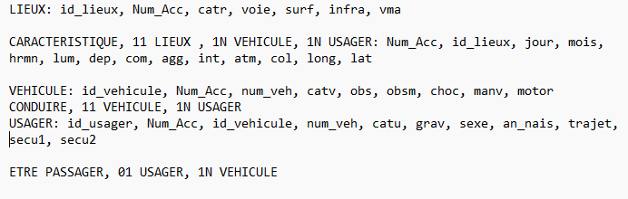
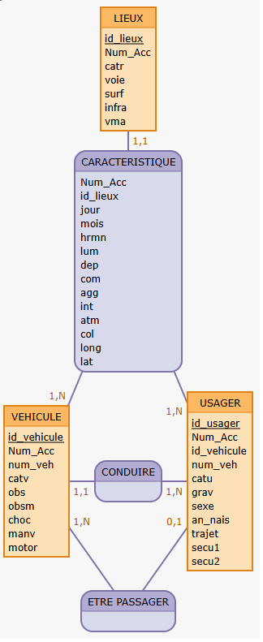

```{r setup, include=FALSE}
knitr::opts_chunk$set(echo = TRUE)
```


# Introduction {.label:s-intro}

## Introduction

 L'étude des accidents de la route survenus au cours d'une année est utile pour prendre des mesures de sécurité, d'aménagement urbain ou encore de sensibilisation visant à réduire leur nombre. C'est pourquoi l'étude des caractéristiques des accidents ou encore des acteurs de ces accidents est primordiale pour obtenir des résultats réprésentatifs. Dans le cadre d'un travail universitaire nous nous sommes interrogés sur la problématique suivante : 
\bigskip

\begin{center}

\textbf{ "Quels sont principaux les facteurs contribuant aux accidents de la route dans l'Hérault en 2023, et comment adapter les mesures de prévention pour réduire leur nombre et leur gravité ?"}

\end{center}
\medskip 

\justifying

La question des accidents corporels de la route reste encore aujourd'hui au coeur des mesures de prévention publique. Dans un monde où les populations ne cessent de croître et où les gens ne circulent que davantage, se demander de quelle manière améliorer la sécurité des usagers est nécessaire. Elle peut d'ailleurs se présenter sous deux aspects, comment promouvoir de nouvelles manières de circuler mais aussi comment adapter les infrastrutures déjà existantes au vu des données que l'on dispose.

\medskip


## Responsabilités et composition de l’équipe
\textbf{Principaux rôles de chacun :}

- \textbf{Bouteyre Maxime (Étudiant n°22313124)} : Responsable de la collecte des données, Participation à la rédaction aux parties Introduction et BD du rapport, Réalisation de requêtes SQL, co-responsable de la coordination de la vidéo de présentation.

- \textbf{Seveyrat Camille (Étudiant n°2230344)} : Participation à la collecte des données, Responsable de la rédaction et de mise en page du rapport, Réalisation de requêtes SQL, Réalisation de l'ensemble des graphiques, des tests statistiques et conclusions.

- \textbf{Boccaccio Mélissa (Étudiant n°22400372)} : Responsable de la collecte de données, Responsable du nettoyage et filtrage des données, Réalisation de requêtes SQL, Co-responsable de la coordination de la vidéo de présentation, Réalisation des diapositives et montage de la vidéo de présentation.

- \textbf{Petiot Mika (Étudiant n°22313118)} : Responsable de la collecte de données, Réalisation de requêtes SQL.


# Base de données

## Provenance des données

 Les données utilisées pour l'étude ont été extraites sur le site data.gouv et obtenables via le lien suivant : \href{https://www.data.gouv.fr/fr/datasets/bases-de-donnees-annuelles-des-accidents-corporels-de-la-circulation-routiere-annees-de-2005-a-2023/}{\texttt{data.gouv.fr}}.
 
  Elles portent sur les accidents de la route en 2023. Notre base de données est composée de 4 jeux de données différents contenant des informations sur les usagers, les lieux d'accidents, les véhicules impliqués ou encore les caractéristiques de l'accident en lui-même. 


\bigskip

Le premier fichier CSV du jeu de données, intitulé \texttt{usagers\_filtre.csv}, regroupe des informations concernant les usagers de la route. Dans le cadre de cette étude, nous avons décidé de retirer deux colonnes initialement présentes : \texttt{etatp} et \texttt{place}. La première indiquait si un piéton était accompagné, tandis que la seconde précisait la place occupée par l’usager dans le véhicule. Ces deux variables ont été jugées non pertinentes pour répondre à notre problématique.

\bigskip

Le second fichier CSV, intitulé \texttt{vehicule-2023.csv}, contient des informations relatives aux véhicules impliqués dans les accidents. Deux colonnes ont été retirées de ce fichier : \texttt{senc} et \texttt{occutc}. La première indiquait le sens de circulation du véhicule, tandis que la seconde renseignait le nombre de passagers à bord d’un transport en commun (uniquement si le véhicule concerné en était un). Ces variables ont été jugées peu pertinentes pour notre analyse.

\bigskip

Le troisième fichier CSV, intitulé \texttt{lieux-2023.csv}, porte sur les lieux des accidents. Plusieurs colonnes ont été supprimées : \texttt{V1}, \texttt{V2}, \texttt{vosp}, \texttt{pr}, \texttt{pr1}, \texttt{lartpc} et \texttt{larrout}. Ces variables contenaient soit des informations trop détaillées et difficiles à exploiter, soit des données manquantes n'apportant pas d’intérêt analytique.

\bigskip

Enfin, le quatrième fichier CSV, intitulé \texttt{caracteristiques-2023.csv}, regroupe les principales caractéristiques des accidents : date, heure, conditions de luminosité, conditions météorologiques, etc. Ce fichier constitue la base principale pour comprendre le contexte global des événements étudiés.

  
\bigskip
\bigskip


## Orientation de l'étude

Afin de structurer notre analyse, nous avons choisi de regrouper les variables disponibles en trois grandes catégories de facteurs susceptibles d’influencer la survenue et la gravité des accidents de la route : les facteurs humains, les facteurs environnementaux et les facteurs liés à l’infrastructure routière.

Cette organisation permet d’aborder l’étude de manière logique et complète :

- les facteurs humains englobent les caractéristiques des usagers (âge, sexe, comportement, équipement…) ;
- les facteurs environnementaux concernent les conditions dans lesquelles se produit l’accident (météo, luminosité, état de la chaussée…) ;
- les facteurs liés à la route incluent les aspects du réseau routier (catégorie de route, vitesse autorisée, présence d’intersections…).

Cette structuration reflète la manière dont les accidents sont généralement abordés dans les analyses de sécurité routière, en distinguant les causes liées aux individus, au contexte, et au système de circulation lui-même.


\bigskip
\bigskip


## Descriptif des tables

\bigskip

1. Les usagers
\begin{table}[H]
\centering
\begin{tabular}{|p{2.5cm}|p{1.5cm}|p{6cm}|p{3cm}|}
\hline
\textbf{Nom colonne} & \textbf{Type} & \textbf{Signification} & \textbf{Caractéristique} \\
\hline
id\_usager & Int & Identifiant unique de l’usager (y compris piétons) & Unique, clef primaire \\
\hline
Num\_acc & Int & Numéro d'identifiant de l’accident & Unique, clef étrangère \\
\hline
num\_veh & Int & Identifiant du véhicule pour chaque usager & Code alphanumérique \\
\hline
catu & Int & Catégorie d'usager &  \\
\hline
grav & Int & Gravité de blessure de l'usager &  \\
\hline
sexe & Int & Sexe de l'usager &  \\
\hline
an\_nais & Int & Année de naissance de l'usager &  \\
\hline
trajet & Int & Motif du déplacement au moment de l'accident &  \\
\hline
secu1 / secu2 / secu3 & Int & Présence et utilisation d'un équipement de sécurité &  \\
\hline
\end{tabular}
\caption{Description des variables de la table \texttt{usagers\_filtre} (1548 $\times$ 15)}
\end{table}

\newpage


2. Les véhicules
\begin{table}[H]
\centering
\begin{tabular}{|p{2.5cm}|p{1.5cm}|p{6cm}|p{3cm}|}
\hline
\textbf{Nom colonne} & \textbf{Type} & \textbf{Signification} & \textbf{Caractéristique} \\
\hline
id-vehicule & Int & Identifiant unique du véhicule (avec usagers rattachés) & Unique, clef primaire \\
\hline
Num\_acc & Int & Numéro d'identifiant de l’accident & Clef étrangère \\
\hline
num-veh & Int & Identifiant du véhicule pour chaque usager & Code alphanumérique \\
\hline
catv & Int & Catégorie du véhicule &  \\
\hline
obs & Int & Obstacle fixe heurté &  \\
\hline
obsm & Int & Obstacle mobile heurté &  \\
\hline
choc & Int & Point de choc initial &  \\
\hline
manv & Int & Manœuvre principale avant l'accident &  \\
\hline
motor & Int & Type de motorisation du véhicule &  \\
\hline
\end{tabular}
\caption{Description des variables de la table \texttt{vehicule\_filtre} (1154 $\times$ 10)}
\end{table}


3. Les lieux
\begin{table}[H]
\centering
\begin{tabular}{|p{2.5cm}|p{1.5cm}|p{6cm}|p{3cm}|}
\hline
\textbf{Nom colonne} & \textbf{Type} & \textbf{Signification} & \textbf{Caractéristique} \\
\hline
id\_lieux & Int & Identifiant du lieu & Unique, clef primaire \\
\hline
Num\_acc & Int & Numéro identifiant de l'accident & Clef étrangère \\
\hline
catr & Int & Catégorie de la route &  \\
\hline
voie & Varchar & Numéro ou nom de la route &  \\
\hline
surf & Int & État de la surface de la route &  \\
\hline
infra & Int & Aménagements - Infrastructures &  \\
\hline
vma & Int & Vitesse maximale autorisée &  \\
\hline
\end{tabular}
\caption{Description des variables de la table \texttt{lieux\_filtre} (660 $\times$ 12)}
\end{table}

\newpage


4. Les caractéristiques
\begin{table}[H]
\centering
\begin{tabular}{|p{2.5cm}|p{1.5cm}|p{6cm}|p{3cm}|}
\hline
\textbf{Nom colonne} & \textbf{Type} & \textbf{Signification} & \textbf{Caractéristique} \\
\hline
Num\_acc & Int & Numéro identifiant de l'accident & Unique, clef primaire \\
\hline
id\_lieux & Int & Identifiant du lieu de l'accident & Clef étrangère \\
\hline
jour & Int & Jour de l'accident &  \\
\hline
mois & Int & Mois de l'accident &  \\
\hline
hrmn & Int & Heure et minute de l'accident &  \\
\hline
lum & Int & Conditions d’éclairage lors de l'accident &  \\
\hline
dep & Int & Code INSEE du département &  \\
\hline
com & Int & Code INSEE de la commune &  \\
\hline
agg & Int & Localisation (agglomération ou hors) &  \\
\hline
inte & Int & Présence d'une intersection &  \\
\hline
atm & Int & Condition atmosphérique &  \\
\hline
col & Int & Type de collision &  \\
\hline
longi & Int & Longitude &  \\
\hline
lat & Int & Latitude &  \\
\hline
\end{tabular}
\caption{Description des variables de la table \texttt{caract\_filtre} (660 $\times$ 16)}
\end{table}

\bigskip

## Modèles MCD et MOD

- Modèles MCD et MOD réalisés sous Mocodo online :

{width="422" height="134"}

{width="160" height="392"}


\bigskip


## Import des données ^
\bigskip

- Avant l'import des données dans phpMyAdmin (Mamp), nous avons procédé à un nettoyage puis un filtrage des données. Nous avons dans un premier temps retiré des tables certaines de leurs colonnes, qui contenaient des données peu utiles pour répondre à la problématique. Dans un souci de taille limite pour l'import des données, nous avons aussi du réduire le nombre maximal de nos individus dans nos tables. Pour cela nous avons décidé de concentrer notre étude sur le département de l'Hérault en conservant uniquement les données pour lesquelles la variable dep de la table caract_filtre valait 34. Cette étape de filtration a été réalisée à l'aide d'un programme Python. 
\medskip
- Pour pouvoir enfin importer les données dans SQL (Mamp), il a fallu créer les tables pour les contenir. Nous avons donc élaboré un script SQL permettant de les créer. 

\bigskip

## Requêtes réalisées
\bigskip

Nous avons réalisé plusieurs requêtes SQL directement sur la base de données afin d’obtenir un premier aperçu des relations possibles entre certaines variables.  
Ces requêtes ont permis de dégager des tendances générales, d’identifier des sous-groupes intéressants, ou encore de vérifier la qualité des données.  
Les requêtes SQL complètes ne sont pas toutes affichées sur le document PDF, afin de pouvoir alléger le rapport.
Les résultats eux sont tous affichés, présentés sous forme de tableau, avec une analyse des résultats pour chacune des requêtes.  


\bigskip
\begingroup
\noindent\large\textbf{Facteurs humains}
\par
\endgroup
\bigskip

**- Répartition de la mortalité de l’accident par tranche d’âge et par sexe:**

\bigskip
\begin{figure}[H]
\centering
\includegraphics[width=\textwidth]{requete.png}
\caption{Exemple de code SQL - Première requête}
\end{figure}
\bigskip

```{r connection_mamp8, echo=FALSE, message=FALSE, warning=FALSE}
library(DBI)
library(RMariaDB)
library(kableExtra)


# Connexion à MySQL/MariaDB via MAMP
con <- dbConnect(
  RMariaDB::MariaDB(),
  user = "root",
  password = "root",
  host = "127.0.0.1",
  port = 3306,
  dbname = "alcolocov2"
)

# Requête
resultat <- dbGetQuery(con, "SELECT u.sexe,
  CASE 
    WHEN u.age < 18 THEN 'Moins de 18'
    WHEN u.age BETWEEN 18 AND 35 THEN '18-35'
    WHEN u.age BETWEEN 36 AND 60 THEN '36-60'
    ELSE '60+'
  END AS tranche_age,
  COUNT(*) AS nb_graves
FROM usagers_filtre u
JOIN vehicules_filtre v ON u.id_vehicule = v.id_vehicule
JOIN caract_filtre c ON v.Num_acc = c.Num_acc
WHERE u.grav = 2
GROUP BY u.sexe, tranche_age
ORDER BY u.sexe, tranche_age;
")

# Affichage compact
kable(resultat) %>%
  kable_styling(latex_options = "scale_down", full_width = FALSE)
```
\bigskip


\underline{\textbf{Analyse des résultats}}

On observe une prédominance masculine dans l'implication dans les accidents mortels (environ 76% d'hommes) et que les tranche d'âge les plus touchées chez les deux sexes sont : pour les femmes celles âgées de plus de 60 ans et chez les hommes, ceux âgés de 35 à 60 ans. 


\bigskip
\bigskip


**- Influence du port de la ceinture sur la gravité des blessures des usagers (limité aux véhicules où une ceinture est normalement utilisée) :**

\bigskip

```{r connection_mamp2, echo=FALSE, message=FALSE, warning=FALSE}
library(DBI)
library(RMariaDB)
library(kableExtra)

# Connexion à MySQL/MariaDB via MAMP
con <- dbConnect(
  RMariaDB::MariaDB(),
  user = "root",
  password = "root",
  host = "127.0.0.1",
  port = 3306,
  dbname = "alcolocov2"
)

# Requête
resultat <- dbGetQuery(con, "SELECT  
CASE # libellés gravité
	WHEN u.grav = 1 THEN 'Indemne'
    WHEN u.grav = 2 THEN 'Tué'
    WHEN u.grav = 3 THEN 'Blessé hospitalisé'
    WHEN u.grav = 4 THEN 'Blessé léger'
    ELSE 'Autre'
  END AS grav,
    COUNT(*) AS nb_accidents, 
    COUNT(CASE WHEN u.secu1 = 1 
      OR u.secu2 = 1 
      OR u.secu3 = 1 THEN 1 END) AS nb_avec_ceinture, 
    COUNT(*) - COUNT(CASE WHEN u.secu1 = 1 
      OR u.secu2 = 1 
      OR u.secu3 = 1 THEN 1 END) AS nb_sans_ceinture
    
FROM vehicules_filtre v
JOIN usagers_filtre u ON v.Num_Acc = u.Num_Acc # jointure sur le numéro d'accident
WHERE v.catv IN (7, 9, 10, 13, 14, 15, 17) 
GROUP BY u.grav; 
")

# Affichage compact
kable(resultat) %>%
  kable_styling(latex_options = "scale_down", full_width = FALSE)

```

\bigskip

\underline{\textbf{Analyse des résultats}}

$$
\begin{array}{rl}
\text{Total sans ceinture} &= 665 \\
\text{Total avec ceinture} &= 1\,504 \\[0.5em]
\text{Proportion tués avec ceinture} &= 2{,}593\% \\
\text{Proportion tués sans ceinture} &= 6{,}617\% \\
\text{Proportion blessés hospitalisés avec ceinture} &= 15{,}16\% \\
\text{Proportion blessés hospitalisés sans ceinture} &=  35{,}489\% \\
\end{array}
$$
En ne portant pas la ceinture de sécurité, les usagers s'exposent à un risque environ 2,5 fois plus élevé de mourir ou d'être blessé lors d'un accident.

\bigskip
\bigskip

**- Port des équipement de sécurité (casque ou ceinture) selon le type de véhicule des usagers, triés par tranche d’âge :**

\bigskip

```{r connection_mamp3, echo=FALSE, message=FALSE, warning=FALSE}
library(DBI)
library(RMariaDB)
library(kableExtra)

# Connexion à MySQL/MariaDB via MAMP
con <- dbConnect(
  RMariaDB::MariaDB(),
  user = "root",
  password = "root",
  host = "127.0.0.1",
  port = 3306,
  dbname = "alcolocov2"
)

# Requête
resultat <- dbGetQuery(con, "SELECT
  CASE 
    WHEN v.catv IN (31, 32, 33, 41, 42, 43) THEN 'Moto'
    WHEN v.catv = 1 THEN 'Vélo'
    WHEN v.catv IN (7, 10, 13, 14, 15) THEN 'Voiture'
    ELSE 'Autre'
  END AS type_vehicule,
  
  CASE 
    WHEN u.age < 18 THEN 'Moins de 18'
    WHEN u.age BETWEEN 18 AND 35 THEN '18-35'
    WHEN u.age BETWEEN 36 AND 60 THEN '36-60'
    ELSE '60+'
  END AS tranche_age,

  COUNT(*) AS total_usagers, 

  SUM(CASE 
			  # si l'usager est en moto (code catégorie véhicule) ET porte un casque (valeur 2 dans secu1, secu2 ou secu3)
        WHEN v.catv IN (31, 32, 33, 41, 42, 43) 
             AND (u.secu1 = 2 OR u.secu2 = 2 OR u.secu3 = 2) 
        THEN 1 
        
        # si l'usager est en vélo ET porte un casque
        WHEN v.catv = 1 
             AND (u.secu1 = 2 OR u.secu2 = 2 OR u.secu3 = 2) 
        THEN 1
        
        # si l'usager est en voiture ET porte une ceinture
        WHEN v.catv IN (7, 10, 13, 14, 15) 
             AND (u.secu1 = 1 OR u.secu2 = 1 OR u.secu3 = 1) 
        THEN 1
        
        # sinon, on n'ajoute rien (pas d’équipement volontaire détecté)
        ELSE 0 
      END) AS nb_avec_equipement_volontaire 
FROM usagers_filtre u
JOIN vehicules_filtre v ON u.id_vehicule = v.id_vehicule
WHERE v.catv IN (1, 7, 10, 13, 14, 15, 31, 32, 33, 41, 42, 43)
AND u.catu IN (1, 2) 
GROUP BY type_vehicule, tranche_age 
ORDER BY tranche_age, type_vehicule; 
")

# Affichage compact
kable(resultat) %>%
  kable_styling(latex_options = "scale_down", full_width = FALSE)
```

\bigskip

\underline{\textbf{Analyse des résultats}}

Voiture : les taux d’équipement sont élevés mais légèrement décroissants avec l’âge :

- Moins de 18 ans : 77,6 %
- 18–35 ans : 87,6 %
- 36–60 ans : 86,0 %
- 60 ans et plus : 77,7 %

Moto : les taux sont excellents dans toutes les tranches d’âge :

- Moins de 18 ans : 100 %
- 18–35 ans : 96,7 %
- 36–60 ans : 98,9 %
- 60 ans et plus : 100 %

Vélo : les taux sont beaucoup plus faibles, en particulier chez les plus jeunes :

- Moins de 18 ans : 25 %
- 18–35 ans : 40 %
- 36–60 ans : 83,3 %
- 60 ans et plus : 58,8 %

On voit donc que les usagers de moto sont les mieux protégés, avec des taux proches ou égaux à 100 %.
Les moins bien protégés sont les cyclistes, surtout chez les jeunes.


\bigskip
\bigskip


\begingroup
\noindent\large\textbf{Facteurs environnementaux}
\par
\endgroup
\bigskip

**- Nombre d’accidents et gravité des blessures par rapport à l’état de la surface :**

\bigskip


```{r connection_mamp4, echo=FALSE, message=FALSE, warning=FALSE}
library(DBI)
library(RMariaDB)
library(kableExtra)

# Connexion à MySQL/MariaDB via MAMP
con <- dbConnect(
  RMariaDB::MariaDB(),
  user = "root",
  password = "root",
  host = "127.0.0.1",
  port = 3306,
  dbname = "alcolocov2"
)

# Requête SQL
resultat <- dbGetQuery(con, "
SELECT 
  l.surf,
  COUNT(*) AS nb_accidents, -- Nombre total d'accidents par surface
  SUM(CASE WHEN u.grav = 2 THEN 1 ELSE 0 END) AS nb_morts, 
  -- Nombre de décès
  SUM(CASE WHEN u.grav = 3 THEN 1 ELSE 0 END) AS blesses_hosp, 
  -- Nombre de blessés hospitalisés
  SUM(CASE WHEN u.grav = 4 THEN 1 ELSE 0 END) AS blesses_legers 
  -- Nombre de blessés légers
FROM caract_filtre c
INNER JOIN lieux_filtre l ON c.id_lieux = l.id_lieux
INNER JOIN usagers_filtre u ON c.Num_Acc = u.Num_Acc
GROUP BY l.surf
ORDER BY nb_accidents DESC
")

# Affichage compact
kable(resultat) %>%
  kable_styling(latex_options = "scale_down", full_width = FALSE)

```

\bigskip


\begin{table}[H]
\centering
\small
\begin{tabular}{|p{1.5cm}|p{5cm}|p{1.5cm}|p{5cm}|}
\hline
\textbf{Code} & \textbf{Signification} & \textbf{Code} & \textbf{Signification} \\
\hline
5 & Enneigée & -1 & Non renseigné \\
6 & Boue & 1 & Normale \\
7 & Verglacée & 2 & Mouillée \\
8 & Corps gras – huile & 3 & Flaques \\
9 & Autre & 4 & Inondée \\
\hline
\end{tabular}
\caption{Codes et significations pour la variable \texttt{surf}, répartis en deux colonnes.}
\label{tab:surf}
\end{table}


\bigskip


\underline{\textbf{Analyse des résultats}}

Dans l’Hérault, le nombre de jours avec une météo favorable (route sèche) est élevé, ce qui explique la prédominance des accidents sur surface normale.

$$
\begin{array}{rl}
\text{Taux de tués sur surface mouillée} &= \dfrac{7}{119} \approx 5{,}9\% \\
\text{Taux de tués sur surface normale} &= \dfrac{62}{1406} \approx 4{,}4\% \\
\text{Taux de tués sur surface "Autre"} &= \dfrac{2}{12} \approx 16{,}7\%
\end{array}
$$

Les surfaces inhabituelles (neige, verglas, flaques, huile, etc.) sont moins fréquentes mais associées à une plus grande gravité des accidents.


\bigskip
\bigskip

**- Impact de la luminosité sur le nombre d’accidents et influence des éclairages publics sur la gravité des blessures des usagers**
\bigskip

*a) Nombre d’accidents par niveau de luminosité :*

\bigskip


```{r connection_mamp5, echo=FALSE, message=FALSE, warning=FALSE}
library(DBI)
library(RMariaDB)
library(kableExtra)

# Connexion à MySQL/MariaDB via MAMP
con <- dbConnect(
  RMariaDB::MariaDB(),
  user = "root",
  password = "root",
  host = "127.0.0.1",
  port = 3306,
  dbname = "alcolocov2"
)

# Requête
resultat <- dbGetQuery(con, "SELECT 
CASE # libellés éclairages
	WHEN lum = 1 THEN 'Plein jour'
    WHEN lum = 2 THEN 'Crépuscule ou aube'
    WHEN lum = 3 THEN 'Nuit sans éclairage public'
    WHEN lum = 4 THEN 'Nuit avec éclairage public non allumé'
    WHEN lum = 5 THEN 'Nuit avec éclairage public allumé'
END AS condition_eclairage,
COUNT(*) AS nb_accidents 
FROM caract_filtre
GROUP BY condition_eclairage
ORDER BY nb_accidents DESC; 
")

# Affichage compact
kable(resultat) %>%
  kable_styling(latex_options = "scale_down", full_width = FALSE)

```
\bigskip


D'après les résultats, le nombre d'accidents est plus élevé en plein jour. Cependant, on ne peut pas tirer de conclusion intéressante avec ce seul résultat : la circulation est bien plus active le jour que la nuit, ce qui explique le nombre beaucoup plus élevé d’accidents le jour. 

Mais on peut tout de même voir que la nuit, l’absence d’éclairages publics semble être un facteur augmentant le nombre d’accidents.

On peut donc se poser la question :

\bigskip


*b) La présence d’éclairages publics la nuit a-t-elle une influence sur la gravité des blessures des usagers ?*

\bigskip


```{r connection_mamp6, echo=FALSE, message=FALSE, warning=FALSE}
library(DBI)
library(RMariaDB)
library(kableExtra)

# Connexion à MySQL/MariaDB via MAMP
con <- dbConnect(
  RMariaDB::MariaDB(),
  user = "root",
  password = "root",
  host = "127.0.0.1",
  port = 3306,
  dbname = "alcolocov2"
)

# Requête
resultat <- dbGetQuery(con, "SELECT
  CASE # libellés éclairages (de nuit)
    WHEN c.lum IN (3, 4) THEN 'Éclairage absent ou non allumé'
    WHEN c.lum = 5 THEN 'Éclairage allumé'
  END AS condition_eclairage,
  CASE # libellés gravité
    WHEN u.grav = 1 THEN 'Indemne'
    WHEN u.grav = 2 THEN 'Tué'
    WHEN u.grav = 3 THEN 'Blessé hospitalisé'
    WHEN u.grav = 4 THEN 'Blessé léger'
    ELSE 'Non renseigné'
  END AS gravite,
  COUNT(*) AS nb_usagers 
FROM usagers_filtre u
JOIN caract_filtre c ON u.Num_Acc = c.Num_Acc 
WHERE c.lum IN (3, 4, 5) 
GROUP BY condition_eclairage, gravite 
ORDER BY condition_eclairage, gravite; 
")

# Affichage compact
kable(resultat) %>%
  kable_styling(latex_options = "scale_down", full_width = FALSE)

```

\underline{\textbf{Analyse des résultats}}

- **Sans éclairage** : environ \( \frac{105}{176} \times 100 \approx 60\% \) des accidents
- **Avec éclairage** : environ \( \frac{71}{176} \times 100 \approx 40\% \) des accidents

\bigskip

\begin{table}[H]
\centering
\small
\begin{tabular}{|p{4.5cm}|p{2.33cm}|p{2.33cm}|p{3.83cm}|}
\hline
\textbf{Condition d'éclairage} & \textbf{Tués} & \textbf{Nombre d'accidents} & \textbf{Taux de tués par accident} \\
\hline
Sans éclairage & 23 & 105 & \( \frac{23}{105} \approx 21{,}9\% \) \\
\hline
Avec éclairage public allumé  & 4 & 71 & \( \frac{4}{71} \approx 5{,}6\% \) \\
\hline
\end{tabular}
\caption{Répartition des tués selon la condition d’éclairage}
\end{table}

On peut donc dire qu'ici, les accidents de nuit **sans éclairage** sont **près de 4 fois plus mortels** (en proportion) que ceux de nuit **avec éclairage** !


\bigskip
\bigskip
\begingroup
\noindent\large\textbf{Facteurs liés à la route}
\par
\endgroup
\bigskip

**- Nombre d’accidents, nombre d’usagers impliqués et nombre de morts parmi ces usagers par catégorie de véhicule :**

\bigskip


```{r connection_mamp7, echo=FALSE, message=FALSE, warning=FALSE}
library(DBI)
library(RMariaDB)
library(kableExtra)

# Connexion à MySQL/MariaDB via MAMP
con <- dbConnect(
  RMariaDB::MariaDB(),
  user = "root",
  password = "root",
  host = "127.0.0.1",
  port = 3306,
  dbname = "alcolocov2"
)

# Requête
resultat <- dbGetQuery(con, "SELECT
v.catv,
COUNT(DISTINCT v.Num_Acc) AS nb_accidents, 
COUNT(u.id_usager) AS total_usagers, 
SUM(CASE WHEN u.grav = 2 THEN 1 ELSE 0 END) AS nb_morts 
FROM vehicules_filtre v
JOIN usagers_filtre u ON v.id_vehicule = u.id_vehicule 
GROUP BY v.catv 
ORDER BY nb_morts DESC 
LIMIT 12; 
")

# Affichage compact
kable(resultat) %>%
  kable_styling(latex_options = "scale_down", full_width = FALSE)

```

\bigskip


\underline{\textbf{Analyse des résultats}}

Les voitures légères sont impliquées dans le plus grand nombre d’accidents, ce qui reflète leur forte présence sur les routes. 
En revanche, les deux-roues motorisés, notamment les grosses cylindrées, présentent un risque de mortalité nettement plus élevé. 
Certains véhicules comme les utilitaires légers, vélos électriques ou quads sont aussi associés à des accidents graves, malgré une fréquence plus faible.

\bigskip
\bigskip


**- Répartition du nombre d’accidents selon le type d’infrastructure, en agglomération et hors agglomération :**

\bigskip


```{r connection_mamp9, echo=FALSE, message=FALSE, warning=FALSE}
library(DBI)
library(RMariaDB)
library(kableExtra)

# Connexion à MySQL/MariaDB via MAMP
con <- dbConnect(
  RMariaDB::MariaDB(),
  user = "root",
  password = "root",
  host = "127.0.0.1",
  port = 3306,
  dbname = "alcolocov2"
)

# Requête
resultat <- dbGetQuery(con, "SELECT 
  CASE lieux_filtre.infra
    WHEN -1 THEN 'Non renseigné'
    WHEN 0 THEN 'Aucun aménagement'
    WHEN 1 THEN 'Souterrain / tunnel'
    WHEN 2 THEN 'Pont / autopont'
    WHEN 3 THEN 'Bretelle d’échangeur'
    WHEN 4 THEN 'Voie ferrée'
    WHEN 5 THEN 'Carrefour aménagé'
    WHEN 6 THEN 'Zone piétonne'
    WHEN 7 THEN 'Zone de péage'
    WHEN 8 THEN 'Chantier'
    WHEN 9 THEN 'Autre'
    ELSE 'Inconnu'
  END AS infra,

  caract_filtre.agg AS agg,

  COUNT(*) AS nb_accidents

FROM lieux_filtre
JOIN caract_filtre ON lieux_filtre.id_lieux = caract_filtre.id_lieux
GROUP BY lieux_filtre.infra, caract_filtre.agg
ORDER BY nb_accidents DESC, lieux_filtre.infra, caract_filtre.agg;
")

# Affichage compact
kable(resultat) %>%
  kable_styling(latex_options = "scale_down", full_width = FALSE)

```
\bigskip

\underline{\textbf{Analyse des résultats}}

La majorité des accidents surviennent sur des routes sans aménagement spécifique, que ce soit en agglomération ou hors agglomération. Les carrefours aménagés arrivent loin derrière. Les autres types d’infrastructures (ponts, chantiers, zones piétonnes…) sont très peu représentés. De manière générale, les accidents sont plus fréquents en agglomération.

\bigskip
\bigskip


# Matériel et Méthodes

## Logiciels

Toutes les analyses statistiques ont été réalisées à l’aide du logiciel R, via l’environnement RStudio. Les packages principaux utilisés sont \texttt{DBI}, \texttt{ggplot2}.
Pour la gestion de projet, nous avons utilisé l’outil collaboratif Notion afin de partager les scripts R.


## Modélisation statistique

\bigskip


Dans cette étude, nous avons utilisé différents outils statistiques pour analyser les relations entre variables.

\bigskip

- **Analyse descriptive préliminaire** :  
  Graphiques univariés (histogrammes, diagrammes en barres) pour observer la répartition des variables.

\bigskip

*Avantages et limites*

- \underline{Avantage} : donne une première compréhension intuitive des données.  
- \underline{Limite} : descriptif uniquement, sans test d'hypothèse.


---

- **Graphiques croisés** :  
  Graphiques bivariés (diagrammes en barres) pour visualiser les interactions entre variables catégorielles.
\bigskip

*Avantages et limites*

- \underline{Avantage} : facilite l’interprétation visuelle d'une éventuelle association.   
- \underline{Limite} : ne remplace pas un test statistique formel.


---

- **Test du $\chi^2$ d'indépendance** :  
  Utilisé pour évaluer l’existence d’une association entre deux variables qualitatives.

\bigskip

*Hypothèses et présupposés*

Pour utiliser le test du $\chi^2$ d'indépendance, plusieurs hypothèses doivent être respectées :

- Les variables analysées doivent être **catégorielles**.
- Les effectifs théoriques dans le tableau croisé doivent être suffisamment élevés (généralement au moins 5 dans chaque cellule).
- Les observations doivent être indépendantes.

\bigskip

*Avantages et limites*

- \underline{Avantages :}
  - Facile à utiliser pour étudier l'association entre deux variables qualitatives.
  - Résultats facilement interprétables via la p-value.

- \underline{Limites :}
  - Nécessite des effectifs suffisants dans chaque modalité.
  - Ne donne pas d'information sur la force ou la direction de la relation.
  - Sensible aux tailles d'échantillon très grandes ou très petites.
  
\bigskip


*Équations mathématiques associées*

Le test du $\chi^2$ repose sur la statistique suivante :

\[
\chi^2 = \sum \frac{(O_{ij} - E_{ij})^2}{E_{ij}}
\]

où :

- \(O_{ij}\) = effectif observé pour la cellule \(i,j\),
- \(E_{ij}\) = effectif théorique attendu pour la cellule \(i,j\).

L'hypothèse nulle \(H_0\) est : **"Les deux variables sont indépendantes."**


# Analyse exploratoire des données


## Introduction
\bigskip


Avant de procéder à des analyses plus poussées, nous avons réalisé une **analyse exploratoire** des données.  
L'objectif est de mieux comprendre la structure des variables, détecter d’éventuelles anomalies, et orienter les analyses statistiques futures.  

Nous avons effectué des analyses univariées et bivariées sous forme de diagramme ou de tableau.
Chacun est accompagné d'un commentaire succinct.

```{r donnees, include=FALSE, echo=FALSE}
# Répertoire de travail
setwd("C:/Documents/L2 MIASHS/BD/template_2025 - Copie/GroupReportTemplate 2/csv")

# Import des données
vehicules_filtre <- read.csv("vehicules_filtre.csv", header = TRUE, sep = ";", dec = ",", fileEncoding = "latin1")
lieux_filtre <- read.csv("lieux_filtre.csv", header = TRUE, sep = ";", dec = ",", fileEncoding = "latin1")
caract_filtre <- read.csv("caract_filtre.csv", header = TRUE, sep = ";", dec = ",", fileEncoding = "latin1")
usagers_filtre <- read.csv("usagers_filtre.csv", header = TRUE, sep = ";", dec = ",", fileEncoding = "latin1")

# Librairies
library(ggplot2)
library(dplyr)

# Fusion
base <- usagers_filtre %>%
  left_join(vehicules_filtre, by = "Num_Acc") %>%
  left_join(caract_filtre, by = "Num_Acc") %>%
  left_join(lieux_filtre %>% select(Num_Acc, vma), by = "Num_Acc")
```


## Graphiques et Tableaux

\bigskip
\begingroup
\noindent\large\textbf{Facteurs humains}
\par
\endgroup
\bigskip

**Répartition des usagers par tranche d'âge**

- Diagramme en barres - univarié

\bigskip

```{r age, echo=FALSE, fig.width=5, fig.height=3.5}
usagers_filtre <- usagers_filtre %>%
  filter(age >= 0 & age <= 100) %>%
  mutate(tranche_age = case_when(
    age < 18 ~ "Moins de 18",
    age >= 18 & age <= 35 ~ "18–35",
    age >= 36 & age <= 60 ~ "36–60",
    age > 60 ~ "60+"
  ))

ggplot(usagers_filtre, aes(x = tranche_age, fill = tranche_age)) +
  geom_bar(color = "white") +
  scale_fill_manual(values = 
                      c("Moins de 18" = "#FFB347",
                        "18–35" = "#FF6961", 
                        "36–60" = "#779ECB", 
                        "60+" = "#77DD77")) +
  labs(title = "Répartition des usagers selon les tranches\nd'âge définies",
       x = "Tranche d'âge",
       y = "Nombre d'usagers",
       fill = "Tranche d'âge") +
  theme_minimal() +
  theme(
    plot.title = element_text(face = "bold"),
    legend.position = "none"
  )
```
\bigskip

\underline{Commentaire} : La majorité des usagers impliqués ont entre 18 et 60 ans, avec une concentration particulièrement marquée dans la tranche 18–35 ans. Les tranches <18 ans et 60+ sont présentes, mais en moindre proportion.

\bigskip
\bigskip

**Répartition des usagers selon le sexe et la tranche d'âge**

- Diagramme en barres groupées - bivarié

\bigskip

```{r age_sexe, echo=FALSE, fig.width=5, fig.height=3.5}
usagers_filtre %>%
  filter(sexe %in% c(1, 2), age >= 0 & age <= 100) %>%
  mutate(
    tranche_age = case_when(
      age < 18 ~ "Moins de 18",
      age >= 18 & age <= 35 ~ "18–35",
      age >= 36 & age <= 60 ~ "36–60",
      age > 60 ~ "60+"
    ),
    sexe_label = case_when(
      sexe == 1 ~ "Homme",
      sexe == 2 ~ "Femme"
    )
  ) %>%
  count(tranche_age, sexe_label) %>%
  ggplot(aes(x = tranche_age, y = n, fill = sexe_label)) +
  geom_col(position = "dodge") +
  scale_fill_manual(values = 
                      c("Homme" = "steelblue", 
                        "Femme" = "orange")) +
  labs(title = "Répartition des usagers par sexe\net par tranches d'âge définies",
       x = "Tranche d'âge",
       y = "Nombre d'usagers",
       fill = "Sexe") +
  theme_minimal() +
  theme(
    plot.title = element_text(face = "bold"),
    axis.text.x = element_text(angle = 45, hjust = 1)
  )
```

\bigskip

\underline{Commentaire} : Les hommes sont largement majoritaires dans toutes les tranches d’âge, avec une surreprésentation marquée entre 18 et 60 ans. La répartition reste inégale dans les tranches les plus jeunes et les plus âgées.

\bigskip
\bigskip

**Répartition de la mortalité par tranche d’âge et sexe**

- Diagramme en barres empilées - bivarié

\bigskip


```{r mort_age_sexe, fig.cap="Répartition de la mortalité par tranche d’âge et sexe", echo=FALSE, fig.width=5, fig.height=3.5}
table_morts_graph <- base %>%
  filter(grav == 2) %>%  # grav = 2 → Tué
  distinct(id_usager, .keep_all = TRUE) %>%  # Retirer les doublons
  mutate(
    tr_age = case_when(
      age < 18 ~ "Moins de 18",
      age >= 18 & age <= 35 ~ "18–35",
      age >= 36 & age <= 60 ~ "36–60",
      age > 60 ~ "60+",
      TRUE ~ NA_character_
    ),
    sexe_label = case_when(
      sexe == 1 ~ "Homme",
      sexe == 2 ~ "Femme",
      TRUE ~ NA_character_
    )
  ) %>%
  filter(!is.na(tr_age), !is.na(sexe_label)) %>%
  count(tr_age, sexe_label)

# Graphique en barres empilées
ggplot(table_morts_graph, aes(x = tr_age, y = n, fill = sexe_label)) +
  geom_col(position = "stack") +
  labs(
    title = "Répartition de la mortalité par tranche d’âge\net par sexe",
    x = "Tranche d’âge",
    y = "Nombre de personnes tuées",
    fill = "Sexe"
  ) +
  theme_minimal() +
  theme(
    plot.title = element_text(face = "bold"),
    axis.text.x = element_text(angle = 45, hjust = 1)
  )
```
\bigskip
\bigskip

\underline{Commentaire} : La mortalité est la plus élevée chez les usagers âgés de 36 à 60 ans, suivis des 18–35 ans et des 60 ans et plus. Les hommes restent majoritaires parmi les personnes tuées, quelle que soit la tranche d’âge.

\bigskip

---

\bigskip
\begingroup
\noindent\large\textbf{Facteurs environnementaux}
\par
\endgroup
\bigskip

**Nombre d’accidents selon les conditions atmosphériques**

- Diagramme en barres - univarié

\bigskip


```{r atm, echo=FALSE, fig.width=5, fig.height=3.5}
base <- base %>%
  mutate(
    atm_label = case_when(
      atm == 1 ~ "Normale",
      atm %in% 2:9 ~ "Anormale",
      atm == -1 ~ NA_character_,
      TRUE ~ "Inconnu"
    ),
    grav_label = case_when(
      grav == 1 ~ "Indemne",
      grav == 2 ~ "Tué",
      grav == 3 ~ "Blessé hospitalisé",
      grav == 4 ~ "Blessé léger",
      TRUE ~ "Inconnu"
    )
  ) %>%
  filter(!is.na(atm_label), grav_label != "Inconnu")

base <- base %>%
  mutate(
    atm_label = case_when(
      atm == 1 ~ "Normale",
      atm %in% 2:9 ~ "Anormale",
      atm == -1 ~ NA_character_,
      TRUE ~ "Inconnu"
    )
  ) %>%
  filter(!is.na(atm_label))

base_unique <- base %>%
distinct(id_usager, Num_Acc, .keep_all = TRUE)

accidents_atm <- base_unique %>%
group_by(atm_label) %>%
summarise(nb_accidents = n_distinct(Num_Acc), .groups = "drop")

ggplot(accidents_atm, aes(x = reorder(atm_label, -nb_accidents), y = nb_accidents, fill = atm_label)) +
geom_col(show.legend = FALSE) +
labs(title = "Nombre d'accidents selon les conditions\natmosphériques",
x = "Conditions atmosphériques",
y = "Nombre d'accidents") +
theme_minimal() +
coord_flip() + 
  theme(
    plot.title = element_text(face = "bold"),
    axis.text.x = element_text(angle = 45, hjust = 1)
  )
  
```
\bigskip
\bigskip

\underline{Commentaire} : La modalité "Anormale" a été créée par un regroupement de 8 modalités de départ (neige, pluie, brouillard, etc.), car elles présentaient des effectifs trop faibles por une analyse statistique fiable.

\bigskip
\bigskip

**Gravité des accidents selon les conditions atmosphériques**

- Diagramme en barres empilées - bivarié

\bigskip

```{r grav_atm, fig.cap="Gravité des accidents selon les conditions atmosphériques", echo=FALSE, fig.width=5, fig.height=3.5}
base_unique <- base %>%
  distinct(id_usager, .keep_all = TRUE)

gravite_atm <- base_unique %>%
  group_by(atm_label, grav_label) %>%
  summarise(nb = n(), .groups = "drop")

ggplot(gravite_atm, aes(x = atm_label, y = nb, fill = grav_label)) +
  geom_bar(stat = "identity", position = "fill") +
  labs(title = "Gravité des accidents selon les conditions\natmosphériques",
       x = "Conditions atmosphériques",
       y = "Proportion",
       fill = "Gravité") +
  theme_minimal() +
  theme(
    plot.title = element_text(face = "bold"),
    axis.text.x = element_text(angle = 45, hjust = 1)
  )
```
\bigskip

\underline{Commentaire} : La répartition des niveaux de gravité ne varie que très peu selon les conditions atmosphériques. On observe seulement une petite différence de proportion dans les cas des blessés hospitalisés (plus importants en "Anormale"), et dans les cas des blessés légers (plus importants dans la catégorie "Normale")


\bigskip

---

\bigskip
\begingroup
\noindent\large\textbf{Facteurs liés à la route}
\par
\endgroup
\bigskip

**Nombre d'accidents selon la vitesse maximale autorisée**

- Diagramme en barres - univarié

\bigskip

```{r graph_vma, echo = FALSE, fig.width=5, fig.height=3.5}
base <- base %>%
  group_by(Num_Acc, vma) %>%
  mutate(nb_usagers = n()) %>%
  ungroup()

accidents_par_vma <- base %>%
  filter(vma != -1) %>%
  group_by(vma) %>%
  summarise(nb_accidents = n_distinct(Num_Acc), .groups = "drop")

ggplot(accidents_par_vma, aes(x = factor(vma), y = nb_accidents)) +
  geom_col(fill = "steelblue") +
  labs(title = "Nombre d'accidents selon la VMA",
       x = "Vitesse maximale autorisée (VMA)",
       y = "Nombre d'accidents") +
  theme_minimal() +
  theme(
    plot.title = element_text(face = "bold"),
    axis.text.x = element_text(angle = 45, hjust = 1)
  )

```

\bigskip

\underline{Commentaire} : La VMA est principalement de 50 km/h (en régime urbain), avec une fréquence importante. Les autres vitesses (30, 70, 80…) sont moins fréquentes. 


\bigskip
\bigskip

**Nombre d'usagers impliqués selon la vitesse maximale autorisée**

- Boxplots et tableau - bivarié

\bigskip

```{r boxplot_nbusagers, echo=FALSE, fig.width=5, fig.height=3.5}
base %>%
  group_by(Num_Acc, vma) %>%
  summarise(nb_usagers = n(), .groups = "drop") %>%
  ggplot(aes(x = factor(vma), y = nb_usagers)) +
  geom_boxplot() +
  labs(title = "Distribution du nombre d'usagers par VMA")
```

```{r table_stats_usagers, echo=FALSE}

stats_usagers_par_vma <- base %>%
  filter(vma != -1) %>%
  group_by(vma) %>%
  summarise(
    nb_usager = n(),
    moyenne = mean(nb_usagers),
    mediane = median(nb_usagers),
    min = min(nb_usagers),
    max = max(nb_usagers),
    ecart_type = sd(nb_usagers),
    .groups = "drop"
  )

knitr::kable(stats_usagers_par_vma, digits = 1, caption = "Résumé du nombre d'usagers par VMA")
```
\bigskip

\underline{Commentaire} : Le graphique montre la distribution du nombre d’usagers impliqués selon la VMA, représentée sous forme de boxplot. On observe une tendance générale : plus la vitesse maximale autorisée est élevée, plus la médiane du nombre d’usagers impliqués par accident augmente. Cette évolution est confirmée par le tableau, qui présente les statistiques descriptives correspondantes. Par exemple, la médiane passe de 4 usagers à 50 km/h à 15 usagers à 130 km/h.

On observe également une forte augmentation de la dispersion pour les VMA élevées : l’écart-type atteint 13,1 à 130 km/h, contre seulement 2,5 à 30 km/h. Cela signifie que les accidents sur ces axes rapides impliquent non seulement davantage d’usagers en moyenne, mais sont aussi plus variables dans leur ampleur.


\bigskip
\bigskip

**Gravité des blessures selon la vitesse maximale autorisée**

- Diagramme en barres - bivarié

\bigskip

```{r graph_vma2, echo = FALSE, fig.width=5, fig.height=3.5}

base_unique <- base %>%
  distinct(id_usager, .keep_all = TRUE)
resume_vma <- base_unique %>%
  mutate(vma_group = case_when(
    vma <= 30 ~ "<= 30",        
    vma >= 110 ~ ">= 110",      
    vma == 50 ~ "50",           
    vma == 70 ~ "70",           
    vma == 80 ~ "80",           
    vma == 90 ~ "90",           
    TRUE ~ "Autres"             
  )) %>%
  mutate(vma_group = factor(vma_group, levels = c("<= 30", "50", "70", "80", "90", "Autres", ">= 110"))) %>%
  group_by(vma_group, grav) %>%
  summarise(nb_usagers = n(), .groups = 'drop') %>%
  mutate(grav_label = case_when(
    grav == -1 ~ "Indéterminé",
    grav == 1  ~ "Indemne",
    grav == 2  ~ "Tué",
    grav == 3  ~ "Blessé hospitalisé",
    grav == 4  ~ "Blessé léger",
    TRUE       ~ as.character(grav)
  )) %>%
  filter(grav_label != "Indéterminé")

ggplot(resume_vma, aes(x = vma_group, y = nb_usagers, fill = grav_label)) +
  geom_col(position = "dodge") +
  labs(title = "Gravité des blessures selon la VMA",
       x = "Vitesse maximale autorisée (VMA)",
       y = "Nombre d'usagers",
       fill = "Gravité") +
  theme_minimal() +
  theme(
    plot.title = element_text(face = "bold"),
    axis.text.x = element_text(angle = 45, hjust = 1)
  )
```

\bigskip

\underline{Commentaire} : On observe un nombre important d’usagers indemnes sur les routes limitées à 50 km/h, mais également des blessés et hospitalisés à toutes les vitesses.
Les cas de décès, bien que rares, apparaissent à toutes les VMA, y compris les plus basses.


\bigskip
\bigskip


**Proportion des usagers gravement touchés par type de collision**

- Diagramme en barres empilées (en pourcentages) - bivarié

\bigskip

```{r graph_col, echo = FALSE, fig.width=5, fig.height=3.5}
# Jointure avec la table des collisions
collision_gravite <- usagers_filtre %>%
  inner_join(caract_filtre %>% select(Num_Acc, col), by = "Num_Acc")

# Suppression des doublons d'usagers
collision_gravite <- collision_gravite %>%
  distinct(id_usager, .keep_all = TRUE) %>%
  mutate(
    col_label = case_when(
      col == 1 ~ "Frontale",
      col == 2 ~ "Arrière",
      col == 3 ~ "Latérale",
      col == 4 ~ "Chaîne (≥3)",
      col == 5 ~ "Multiples (≥3)",
      col == 6 ~ "Autre collision",
      col == 7 ~ "Sans collision",
      col == -1 ~ "Non renseigné",
      TRUE ~ "Autre"
    ),
    grav_label = case_when(
      grav == 1 ~ "Indemne",
      grav == 2 ~ "Tué",
      grav == 3 ~ "Blessé hospitalisé",
      grav == 4 ~ "Blessé léger",
      TRUE ~ "Indéterminé"
    )
  )

# Création d'une variable binaire : gravement touché ou pas
collision_gravite_graves <- collision_gravite %>%
  filter(!is.na(col_label), grav_label != "Inconnu") %>%
  mutate(
    gravite_grave = case_when(
      grav %in% c(2, 3) ~ "Gravement touché", 
      TRUE ~ "Pas grave"
    )
  )

# Calcul des proportions par type de collision
prop_graves_par_collision <- collision_gravite_graves %>%
  group_by(col_label, gravite_grave) %>%
  summarise(nb = n(), .groups = "drop") %>%
  group_by(col_label) %>%
  mutate(proportion = nb / sum(nb)) %>%
  ungroup()

# Graphique en barres empilées (en pourcentage)
ggplot(prop_graves_par_collision, aes(x = col_label, y = proportion, fill = gravite_grave)) +
  geom_col(position = "fill") +
  scale_y_continuous(labels = scales::percent_format()) +
  labs(title = "Proportion d'usagers gravement touchés\npar type de collision",
       x = "Type de collision",
       y = "Proportion (%)",
       fill = "Gravité") +
  theme_minimal() +
  theme(
    plot.title = element_text(face = "bold"),
    axis.text.x = element_text(angle = 45, hjust = 1)
  )

```
\bigskip
\bigskip

\underline{Commentaire} : Le graphique présente la répartition des usagers selon la gravité des blessures, pour chaque type de collision. On observe des différences de proportions entre les types : par exemple, les "sans collision", "autres collisions" et "frontale" comptent une part plus importante d’usagers gravement touchés.


# Analyse et Résultats
\bigskip

Dans cette partie, nous avons cherché à mettre en évidence d’éventuelles associations entre différentes variables. Étant donné que l’ensemble des variables étudiées sont qualitatives, nous avons utilisé uniquement des tests du $\chi^2$ d’indépendance, qui permettent d’évaluer si deux variables catégorielles sont statistiquement liées.  
\medskip
Chaque analyse présente les hypothèses, les résultats du test et une interprétation.

\bigskip

\bigskip
\begingroup
\noindent\large\textbf{Facteurs humains}
\par
\endgroup
\bigskip

\underline{\textbf{Relation entre l’âge des usagers et le fait d’être tué lors d'un accident}}

```{r test_age, echo = FALSE}
test_age <- base %>%
  distinct(id_usager, .keep_all = TRUE) %>%
  mutate(
    tr_age = case_when(
      age < 18 ~ "Moins de 18",
      age >= 18 & age <= 35 ~ "18–35",
      age >= 36 & age <= 60 ~ "36–60",
      age > 60 ~ "60+",
      TRUE ~ NA_character_
    ),
    tue = ifelse(grav == 2, "Tué", "Non tué")
  ) %>%
  filter(!is.na(tr_age), !is.na(tue))

# Table de contingence
table_age_mort <- table(test_age$tr_age, test_age$tue)

# Test du chi²
chisq.test(table_age_mort)

```
\bigskip
**Hypothèse nulle** : Le fait d’être tué est indépendant de la tranche d’âge.  
**Hypothèse alternative** : Il existe une dépendance entre la tranche d’âge et le fait d’être tué.
\medskip

**Résultat du test** :

- Valeur du $\chi^2$ = 2,6508 
- Degrés de liberté = 3  
- p-value = 0,4487

\bigskip


**Interprétation** :

- La p-value est supérieure à 0.05, donc nous **ne rejetons pas l’hypothèse d’indépendance**.
- Il n’existe **pas de lien statistiquement significatif** entre la tranche d’âge des usagers et la mortalité dans notre jeu de données.
- L’âge ne semble donc **pas influencer significativement** la probabilité d’être tué lors d’un accident, du moins dans les effectifs observés.


\bigskip
\bigskip

\underline{\textbf{Relation entre le sexe des usagers et le fait d’être tué lors d'un accident}}

```{r test_sexe, echo = FALSE}
test_sexe <- base_unique %>%
  distinct(id_usager, .keep_all = TRUE) %>%
  mutate(
    sexe_label = case_when(
      sexe == 1 ~ "Homme",
      sexe == 2 ~ "Femme",
      TRUE ~ NA_character_
    ),
    tue = ifelse(grav == 2, "Tué", "Non tué")
  ) %>%
  filter(!is.na(sexe_label), !is.na(tue))

# Table de contingence
table_sexe_mort <- table(test_sexe$sexe_label, test_sexe$tue)

# Test du chi²
chisq.test(table_sexe_mort)

```
\bigskip

**Hypothèse nulle** : Le fait d’être tué est indépendant du sexe de l’usager.  
**Hypothèse alternative** : Il existe une dépendance entre le sexe et le fait d’être tué.
\medskip

**Résultat du test** 

- Valeur du $\chi^2$ = 1,0719
- Degrés de liberté = 1  
- p-value = 0,3005

\bigskip

**Interprétation** :

- La p-value est supérieure à 0.05, donc nous **ne rejetons pas l’hypothèse d’indépendance**.
- Il n’existe **pas de lien statistiquement significatif** entre le sexe des usagers et la mortalité dans notre échantillon.
- Cela signifie que, dans notre base, le fait d’être un homme ou une femme **n’a pas d’influence significative** sur la probabilité d’être tué dans un accident.


\bigskip

---

\bigskip
\begingroup
\noindent\large\textbf{Facteurs environnementaux}
\par
\endgroup
\bigskip

\underline{\textbf{Relation entre les conditions météorologiques et la gravité des accidents}}

```{r test_atm, echo = FALSE}
base_unique <- base %>% distinct(id_usager, .keep_all = TRUE)
base_filtrée <- base_unique %>%
  filter(!is.na(atm), atm != -1, !is.na(grav)) %>%
  mutate(
    grav_group = case_when(
      grav %in% c(2, 3) ~ "Grave",
      grav %in% c(1, 4) ~ "Non grave",
      TRUE ~ NA_character_
    ),
    atm_label = case_when(
      atm == 1 ~ "Normale",
      atm %in% 2:9 ~ "Anormale",
      TRUE ~ NA_character_
    )
  ) %>%
  filter(!is.na(grav_group), !is.na(atm_label))

# Table de contingence
table_chi2_atm <- table(base_filtrée$atm_label, base_filtrée$grav_group)

# Test du Chi²
chisq.test(table_chi2_atm)

```

\bigskip


**Hypothèse nulle** : La gravité des accidents est indépendante des conditions météorologiques (normales ou anormales).  
**Hypothèse alternative** : Il existe une dépendance entre les conditions météo et la gravité des accidents.
\medskip

**Résultat du test** :

- Valeur du $\chi^2$ = 0,651078
- Degrés de liberté = 1  
- p-value = 0,4198
\bigskip


**Interprétation** :

- La p-value est supérieure à 0.05, donc nous **ne rejetons pas l’hypothèse d’indépendance**.
- Il n’existe **pas de lien statistiquement significatif** entre les conditions météorologiques regroupées (normales vs anormales) et la gravité des accidents dans notre base de données.

\medskip
Pour respecter les conditions d’application du test du $\chi^2$,  ce résultat repose sur un regroupement large des conditions météorologiques en une seule catégorie "Anormale".
Cette simplification inclut des situations très différentes (neige, brouillard, etc.), souvent peu représentées dans notre base, ce qui limite la portée des conclusions spécifiques à chacune de ces conditions.

\bigskip

---

\bigskip
\begingroup
\noindent\large\textbf{Facteurs liés à la route}
\par
\endgroup
\bigskip

\underline{\textbf{Relation entre la vitesse maximale autorisée et la gravité des blessures}}

```{r test_vma, echo = FALSE}
# Test du Chi² - Relation entre la gravité des blessures et la vitesse maximale autorisée
base_unique <- base_unique %>%
  mutate(
    vma_group = case_when(
      vma <= 30 ~ "<= 30",
      vma >= 110 ~ ">= 110",
      vma == -1 ~ NA_character_,
      TRUE ~ "Autres"
    ),
    grav_label = case_when(
      grav == 1 ~ "Indemne",
      grav == 2 ~ "Tué",
      grav == 3 ~ "Blessé hospitalisé",
      grav == 4 ~ "Blessé léger",
      TRUE ~ "Inconnu"
    )
  )

# Exclusion des valeurs inconnues ou manquantes
base_filtrée <- base_unique %>%
  filter(grav_label != "Inconnu", !is.na(vma_group))

# Table de contingence
table_gravite_vma <- table(base_filtrée$vma_group, base_filtrée$grav_label)

# Test du Chi²
chisq_test_result <- chisq.test(table_gravite_vma)

# Affichage du résultat
chisq_test_result

```
\bigskip

**Hypothèse nulle** : La gravité des blessures est indépendante de la VMA.
**Hypothèse alternative** : Il existe une dépendance entre la VMA et la gravité des blessures.
\medskip

**Résultat du test** :

- Valeur du $\chi^2$ = 14.143
- Degrés de liberté = 6
- p-value = 0.02807

\bigskip

**Interprétation** :

- La p-value est inférieure à 0.05, donc nous **rejetons l’hypothèse d’indépendance**.
- Il existe **une relation statistiquement significative** entre la vitesse limite et la gravité des blessures.
- Plus la vitesse autorisée est élevée, plus la gravité des blessures tend à augmenter.

\bigskip
\bigskip

\underline{\textbf{Relation entre le type de collision et la gravité des blessures}}

```{r test_col, echo = FALSE}
collision_gravite <- usagers_filtre %>%
  inner_join(caract_filtre %>% select(Num_Acc, col), by = "Num_Acc")
collision_gravite <- collision_gravite %>%
  mutate(
    col_label = case_when(
      col == 1 ~ "Frontale",
      col == 2 ~ "Arrière",
      col == 3 ~ "Latérale",
      col == 4 ~ "Chaîne (≥3)",
      col == 5 ~ "Multiples (≥3)",
      col == 6 ~ "Autre collision",
      col == 7 ~ "Sans collision",
      col == -1 ~ "Non renseigné",
      TRUE ~ "Autre"
    ),
    grav_label = case_when(
      grav == 1 ~ "Indemne",
      grav == 2 ~ "Tué",
      grav == 3 ~ "Blessé hospitalisé",
      grav == 4 ~ "Blessé léger",
      TRUE ~ "Indéterminé"
    )
  )


# Table de contingence
table_chi2_collision <- table(collision_gravite_graves$col_label, collision_gravite_graves$gravite_grave)

# Test du Chi² 
chisq.test(table_chi2_collision)

```
\bigskip

**Hypothèse nulle** : Le type de collision est indépendant de la gravité des blessures.  
**Hypothèse alternative** : Il existe une dépendance entre le type de collision et la gravité des blessures.
\medskip

**Résultat du test** :

- Valeur du $\chi^2$ = 49,508  
- Degrés de liberté = 6  
- p-value = 5,898e-09

\bigskip

**Interprétation** :

- La p-value est très largement inférieure à 0.05, donc nous **rejetons l’hypothèse d’indépendance**.
- Il existe **une relation statistiquement significative** entre le type de collision et la gravité des blessures.
- Certains types de collision, comme les chocs frontaux ou multiples, sont associés à une proportion plus élevée de blessures graves.


\bigskip
\bigskip

# Discussion

  L’objectif de cette étude était d’identifier les facteurs influençant la survenue et la gravité des accidents de la route dans l’Hérault en 2023. Les analyses statistiques ont permis de clarifier certaines pistes tout en révélant les limites d'autres hypothèses.

\medskip

  Concernant les facteurs humains, les résultats sont nuancés. Ni le sexe ni la tranche d’âge ne montrent d’association statistiquement significative avec la probabilité d’être tué dans un accident. 
Il est important de noter que nos tests statistiques ici ne portaient que sur des facteurs personnels non modifiables pour l’usager, et non sur des éléments comportementaux comme le port d’un équipement de sécurité. L’absence de lien significatif peut aussi s’expliquer par des effectifs trop faibles dans certaines sous-catégories ou par une répartition trop dispersée des cas graves. 
Pourtant, les analyses descriptives avaient mis en évidence une surreprésentation des hommes parmi les victimes décédées, ainsi qu’une plus grande vulnérabilité chez les usagers âgés. Ce décalage souligne l’intérêt de croiser les approches descriptives et inférentielles : un test du $\chi^2$ ou un graphique ne peuvent pas suffire à eux seuls à capturer la complexité de ces phénomènes.

\medskip

  Pour les facteurs environnementaux, aucun lien clair n’a été identifié entre la gravité des blessures et les conditions météorologiques. Toutefois, la différence d’effectif entre les deux catégories de conditions météorologiques, et le regroupement de certaines situations peu fréquentes dans l’Hérault (neige, brouillard, etc.) sous une catégorie large "Anormale" ont très sûrement masqué des effets réels.

\medskip


  En revanche, les facteurs liés à la route se révèlent plus déterminants. La vitesse maximale autorisée est significativement liée à la gravité des blessures : les accidents sur les routes à 110 ou 130 km/h présentent une part plus importante de blessés graves ou de décès, tandis que les zones limitées à 30 ou 50 km/h concentrent des blessures plus légères. Ce constat renforce l’intérêt des politiques de limitation de vitesse dans les zones sensibles.
Le type de collision est également fortement associé à la gravité : les collisions frontales ou multiples entraînent proportionnellement plus de blessures graves. Cela confirme l’influence directe de la violence de l’impact et justifie des mesures spécifiques sur les zones à risque élevé (carrefours mal sécurisés, routes sans séparateur central…).

\medskip

  En résumé, cette étude met en évidence que si les caractéristiques individuelles non modifiables (âge et sexe) des usagers ne permettent pas à elles seules de prédire la gravité d’un accident, les facteurs structurels liés à la route et au type de choc en sont de puissants déterminants. Ces résultats orientent les recommandations vers une combinaison de mesures : aménagements d’infrastructure, régulation de la vitesse, et campagnes de prévention ciblées.


# Conclusion et perspectives {.label:ccl}


**Conclusions principales**

Notre analyse des accidents de la route survenus dans l’Hérault en 2023 met en évidence plusieurs facteurs significativement associés à la gravité des accidents. Les résultats montrent notamment que :

- Les jeunes adultes, particulièrement les hommes âgés de 36 à 60 ans, sont visuellement surreprésentés parmi les usagers blessés gravement ou tués. Cette tranche d’âge semble plus exposée aux comportements à risque, ou moins protégée par les dispositifs de sécurité.Cependant, nous n'avons pas pu trouver de lien statistiquement significatif pour appuyer ce propos.
- Le port de la ceinture de sécurité est un facteur de réduction majeure de la gravité des blessures. Les usagers non équipés présentent une probabilité nettement plus élevée d’hospitalisation ou de décès. 
- Les conditions environnementales telles que la faible luminosité (nuit sans éclairage), et l'état de la surface de la route (surface mouilée, verglacée) aggravent les conséquences des accidents.
- Les accidents graves sont plus fréquents sur les routes où la vitesse maximale autorisée est élevée (routes départementales ou nationales), en particulier en dehors des agglomérations. Moins d'accidents ont lieu sur ces routes-ci qu'en agglomération, mais leur gravité est beaucoup plus élevée.

\bigskip

**Recommandations pour le commanditaire**

À la lumière de ces constats, nous proposons les recommandations suivantes :

- Intensifier les campagnes de prévention ciblées vers les jeunes conducteurs, avec un accent particulier sur le port du casque à deux-roues, surtout à vélo, et de la ceinture à bord des véhicules, qu'on soit passager ou conducteur.
- Mieux signaler les zones à fort risque d’accident, notamment en périphérie ou sur les routes limitées à plus de 70 km/h, en renforçant la visibilité ou la signalisation. 
- Renforcer les contrôles de sécurité routière en soirée et la nuit, moments où la gravité des accidents est accrue. Ajouter davantage d’éclairage public pourrait également contribuer à améliorer la sécurité dans ces créneaux horaires.

\bigskip

**Perspectives à court terme (amélioration de l’analyse)**

- Nettoyer plus finement les données manquantes ou peu fiables, par exemple en excluant les enregistrements où les informations essentielles ne sont pas renseignées, afin d’éviter les biais dans les résultats.
- Intégrer plus de modèles, ainsi que des plus robustes (régression logistique, arbres de décision) pour mieux modéliser les relations entre les variables et la gravité des accidents. 
- Mettre en place une procédure automatique de suppression des doublons pour éviter les biais d’interprétation. 
- Tester d'autres croisements de variables pertinents et plus ciblés sur une population.

\bigskip

**Perspectives à long terme (domaine métier et science des données)**

- Croiser les données d’accidents avec d’autres bases externes, comme les données hospitalières, de géolocalisation, ou encore celles liées à l’alcoolémie et à la consommation de stupéfiants, afin d’enrichir l’analyse de contexte.
- Mettre en oeuvre des modèles prédictifs de gravité d’accident en fonction des caractéristiques en temps réel (heure, météo, trafic, luminosité, etc.) pour fournir des informations utiles aux acteurs publics pour agir concrètement.
- Proposer une application, une plateforme permettant d’identifier les zones à fort risque et d’ajuster les politiques de sécurité. 
- Étendre l’analyse à plusieurs années (analyse temporelle) pour observer des tendances et mesurer l’effet d’éventuelles campagnes de prévention.

\bigskip

**Difficultés rencontrées**

- De nombreuses données non renseignées ont complexifié certaines de nos analyses. 
– La codification des variables qualitatives sous forme de nombres entiers rend la lecture moins intuitive et a nécessité un travail préalable de documentation pour bien les interpréter.
- Les relations "plusieurs usagers et plusieurs véhicules pour un même accident" ont complexifié les jointures entre tables : un accident pouvait apparaître plusieurs fois si les regroupements n’étaient pas bien maîtrisés. Il a donc fallu vérifier rigoureusement les agrégations pour éviter des erreurs de comptage.
- La répartition très inégale de certaines observations a limité la puissance de certaines analyses. 
- Le manque d’information contextuelle (ex. : niveau d’alcoolémie, état de fatigue) restreint la portée explicative de certaines conclusions.

\bigskip
\bigskip

# Annexes {-}

## **Codes** {-}


**- Distribution du nombre d’accidents selon le motif de déplacement du véhicule associé à la gravité des blessures entrainées :**
\bigskip


```{r connection_mamp1, echo=FALSE, message=FALSE, warning=FALSE}
library(DBI)
library(RMariaDB)
library(kableExtra)


# Connexion à MySQL/MariaDB via MAMP
con <- dbConnect(
  RMariaDB::MariaDB(),
  user = "root",
  password = "root",
  host = "127.0.0.1",
  port = 3306,
  dbname = "alcolocov2"
)

# Requête
resultat <- dbGetQuery(con, "SELECT 
  CASE 
    WHEN usagers_filtre.trajet IN (-1, 0) THEN 'Non renseigné'
    WHEN usagers_filtre.trajet = 1 THEN 'Domicile - travail'
    WHEN usagers_filtre.trajet = 2 THEN 'Domicile - école'
    WHEN usagers_filtre.trajet = 3 THEN 'Courses - achats'
    WHEN usagers_filtre.trajet = 4 THEN 'Utilisation professionnelle'
    WHEN usagers_filtre.trajet = 5 THEN 'Promenade - loisirs'
    WHEN usagers_filtre.trajet = 9 THEN 'Autre'
    ELSE 'Inconnu'
  END AS trajet,

  CASE 
    WHEN usagers_filtre.trajet IN (-1, 0) THEN NULL
    ELSE usagers_filtre.grav
  END AS grav,
  
  COUNT(*) AS nb_accident

FROM usagers_filtre
GROUP BY 
  CASE 
    WHEN usagers_filtre.trajet IN (-1, 0) THEN 'Non renseigné'
    WHEN usagers_filtre.trajet = 1 THEN 'Domicile - travail'
    WHEN usagers_filtre.trajet = 2 THEN 'Domicile - école'
    WHEN usagers_filtre.trajet = 3 THEN 'Courses - achats'
    WHEN usagers_filtre.trajet = 4 THEN 'Utilisation professionnelle'
    WHEN usagers_filtre.trajet = 5 THEN 'Promenade - loisirs'
    WHEN usagers_filtre.trajet = 9 THEN 'Autre'
    ELSE 'Inconnu'
  END,
  CASE 
    WHEN usagers_filtre.trajet IN (-1, 0) THEN NULL
    ELSE usagers_filtre.grav
  END

ORDER BY nb_accident DESC, trajet, grav;
")

# Affichage compact
kable(resultat) %>%
  kable_styling(latex_options = "scale_down", full_width = FALSE)
```
\bigskip

\underline{\textbf{Analyse des résultats}}

La distribution du nombre d’accidents en fonction du motif de déplacement et de la gravité des blessures présente une forte proportion de valeurs manquantes, avec 504 cas sur un total de 1119 non renseignés (soit environ 45 % des observations). Ce taux limite fortement l’interprétation globale.

Parmi les données disponibles, les motifs les plus fréquents sont :

- Promenade / loisirs (622 cas), avec une majorité de blessés légers ou indemnes.
- Domicile – travail (160 cas) et utilisation professionnelle (123 cas) apparaissent également comme des trajets à risques modérés.

Les accidents graves (tués) sont rares dans toutes les catégories (entre 1 et 3 cas par motif), ce qui empêche toute comparaison statistique solide.

Conclusion : en raison du taux élevé de données manquantes et de la faible fréquence des cas graves par catégorie, aucun lien clair ne peut être établi entre le motif de déplacement et la gravité des accidents. 

\bigskip
\bigskip

**- Répartition de la gravité de l’accident selon la catégorie de la route :**

\bigskip


```{r connection_mamp0, echo=FALSE, message=FALSE, warning=FALSE}
library(DBI)
library(RMariaDB)
library(kableExtra)

# Connexion à MySQL/MariaDB via MAMP
con <- dbConnect(
  RMariaDB::MariaDB(),
  user = "root",
  password = "root",
  host = "127.0.0.1",
  port = 3306,
  dbname = "alcolocov2"
)

# Requête
resultat <- dbGetQuery(con, "SELECT 
  l.catr, 
  u.grav AS gravite,
  COUNT(*) AS nb_accidents
FROM lieux_filtre l
JOIN caract_filtre c ON l.Num_acc = c.Num_acc
JOIN vehicules_filtre v ON c.Num_acc = v.Num_acc
JOIN usagers_filtre u ON v.id_vehicule = u.id_vehicule
GROUP BY l.catr, u.grav
ORDER BY l.catr, u.grav;
")

# Affichage compact
kable(resultat) %>%
  kable_styling(latex_options = "scale_down", full_width = FALSE)
```

\bigskip
\underline{\textbf{Analyse des résultats}}

Cette analyse croise la gravité des blessures avec la catégorie de route. Bien que certaines tendances semblent émerger (ex. : davantage de tués sur routes départementales), les effectifs sont trop hétérogènes selon les types de routes pour tirer des conclusions solides.
Certaines catégories comme les routes nationales ou les voies hors réseau public sont peu représentées, ce qui rend les comparaisons peu fiables.
Aucune donnée sur le trafic ou l'exposition (ex. : nombre de véhicules circulant par jour) n'est disponible, ce qui empêche de calculer des taux standardisés.


